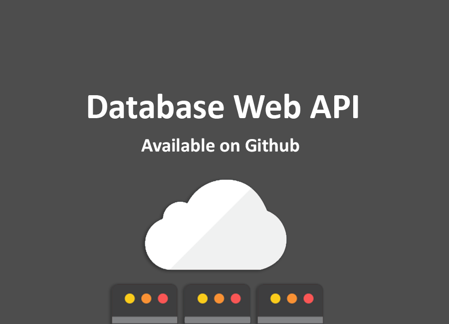

# PHP Database Web API


**Version:** 0.6.114 beta

**Github:** https://github.com/marcocesarato/Database-Web-API

**Author:** Marco Cesarato

## Description
Dynamically generate RESTful APIs from the contents of a database table. Provides JSON, XML, and HTML. Supports most popular databases.

## What problem this solves
Creating an API to access information within existing database tables is laborious task, when done as a bespoke task. This is often dealt with by exporting the contents of the database as CSV files, and providing downloads of them as a “good enough” solution.

## How this solves it
Database Web API acts as a filter, sitting between a database and the browser, allowing users to interact with that database as if it was a native API. The column names function as the key names. This obviates the need for custom code for each database layer.

When Alternative PHP Cache (APC) is installed, parsed data is stored within APC, which accelerates its functionality substantially. While APC is not required, it is recommended highly.

## Wiki

Go to this link for go to the wiki of the platform and have a better informations about the usage of this platform and have more examples:
 
 https://github.com/marcocesarato/Database-Web-API/wiki

## Databases supported
* 4D
* CUBRID
* Firebird/Interbase
* IBM
* Informix
* MS SQL Server
* MySQL
* ODBC and DB2
* Oracle
* PostgreSQL
* SQLite

### Requirements
* PHP
* Database
* APC (optional)

## Installation
* Set the configuration on `config.php`. Follow the below example to register a new dataset. Tip: It's best to provide read-only database credentials here if you want read only.
* _(Optional)_ If you want enable an authentication system you must compile on the `config.php` the constant `__API_AUTH__` as on the example below.
* _(Optional)_ Document the API. For this you can use auto-documentation using file `docs.php`
* _(Optional)_ Use Hooks for manage permissions (as `can_read`, `can_write`, `can_edit`, `can_delete`)

## Configuration
Edit `config.php` to include a single instance of the following for each dataset (including as many instances as you have datasets):

### Define API Name
```php
define("__API_NAME__", "Database Web API"); // API Name
```

### Define datasets

**Dataset configurations:**

| Settings         | Description                                                                        | Default   |
|------------------|------------------------------------------------------------------------------------|-----------|
| default          | Default dataset                                                              | false     |
| api              | Accessible through API                                                          | true      |
| name             | Database Name                                                                      |           |
| username         | Database Username                                                                  | root      |
| password         | Database Password                                                                  | root      |
| server           | Database Server Address                                                            | localhost |
| port             | Database Port                                                                      | 3306      |
| type             | Database Type (ex. `mysql`, `psql` ecc..)                                          | mysql     |
| table_list       | Database Tables Whitelist (Allow only the tables in this list, if empty allow all) | null      |
| table_blacklist  | Database Tables Blacklist                                                          | null      |
| table_docs       | Database Documentation (ex. /dataset/docs/table.html)                             | array()   |
| column_list      | Database Columns's whitelist (Allow only the columns in this list, if empty allow all)      | null      |
| column_blacklist | Database Columns's blacklist                                                                | null      |

#### Example complete with explanation
```php
define("__API_DATASETS__", serialize(array(
	'dataset' => array(
		'default' => true, // Default dataset
		'api' => true, // Accessible from API request url (ex. is false if you have a different database for auth users)
		'name' => 'database_name', // Database name
		'username' => 'user', // root is default
		'password' => 'passwd', // root is default
		'server' => 'localhost',  // localhost default
		'port' => 5432, // 3306 is default
		'type' => 'pgsql', // mysql is default
		'table_list' => array( // Tables's whitelist (Allow only the tables in this list, if empty allow all)
			'users'
		),
		'table_blacklist' => array( // Tables's blacklist
			'passwords'
		),
		'table_docs' => array(
			/** @example
			'table' => array(
				"column" => array(
				"description" => "Column description",
					"example" => "1",
				),
			),
			*/
		), // For Autodocoumentation, url ex. /dataset/docs/table.html
		'column_list' => array( // Columns's whitelist (Allow only the columns in this list, if empty allow all)
			'users' => array(
				'username',
				'name',
				'surname'
			)
		),
		'column_blacklist' => array( // Columns's blacklist
			'users' => array(
				'password',
			)
		),
	),
)));
```

**Note:** All fields of `__API_DATASETS__` (except the name of database) are optional and will default to the above.

#### Example 

Here is a dataset example for a MySQL database named “inspections,” accessed with a MySQL user named “website” and a password of “s3cr3tpa55w0rd,” with MySQL running on the same server as the website, with the standard port of 3306. All tables may be accessed by Database to API except for “cache” and “passwords,” and among the accessible tables, the “password_hint” column may not be accessed via Database to API. All of this is registered to create an API named “facility-inspections”.

```php
array( 
	'default' => true,
	'name' => 'inspections',
	'username' => 'website',
	'password' => 's3cr3tpa55w0rd',
	'server' => 'localhost',
	'port' => 3306,
	'type' => 'mysql',
	'table_docs' => array(),
	'table_list' => array(),
	'table_blacklist' => array('cache', 'passwords'),
	'column_blacklist' => array('password_hint'),
	'column_list' => array(),
);
```

Retrieving the contents of the table history within this dataset as JSON would be accomplished with a request for /facility-inspections/history.json. Note that it is the name of the dataset (facility-inspections) and not the name of the database (inspections) that is specified in the URL.

For a SQLite database, simply provide the path to the database in name.

For an Oracle database, you can either specify a service defined in tsnames.ora (e.g. dept_spending) or you can define an Oracle Instant Client connection string (e.g., //localhost:1521/dept_spending).


### _(Optional)_ Authentication system

#### Auth configuration

| Setting         | Description                                                       | Type  |
|-----------------|-------------------------------------------------------------------|-------|
| sqlite          | When enabled store token on SQLite file                          | Bool  |
| sqlite_database | SQLite filename (only if sqlite = true)                           | Text  |
| api_database    | Set database name where create api_table (Only if sqlite = false) (`__DATASET__`) | Text  |
| api_table       | Set database table name where store tokens                        | Text  |
| users           | Users table to validate                                           | Array |


##### Users configuration

| Setting  | Description                                                                                                                                                                                    | Type  |
|----------|------------------------------------------------------------------------------------------------------------------------------------------------------------------------------------------------|-------|
| database | Database where users are stored (`__DATASET__`)                                                                                                                                                                | Bool  |
| table    | Users table name                                                                                                                                                                               | Text  |
| columns  | 'id' => 'user_id' // Id column name<br>'username' => 'user_name' // Username column name<br>'password' => 'password' // Password column name<br>'admin' => array('is_admin' => 1) // Admin condition (can be null) | Array |
| search   | Search condition                                                                                                                                                                               | Text  |
| check    | Validation users condition (ex. is_active = 1) (can be null)                                                                                                                                                 | Text |

```php
define("__API_AUTH__",  serialize(array( // Set null for disable authentication
	'sqlite' => false, // Enabled save token on SQLite file
	'sqlite_database' => 'api_token', // SQLite filename (only with sqlite = true)
	'api_database' => 'dataset', // Authentication database
	'api_table' => 'api_authentications', // API token table name
	'users' => array(
		'database' => 'dataset', // Database where users are stored
		'table' => 'users', // Table where users are stored
		'columns' => array(
			'id' => 'user_id', // Id column name
			'username' => 'user_name', // Username column name
			'password' => 'password', // Password column name
			'admin' => array('is_admin' => 1) // Admin bypass condition. With this condition true API bypass all black/whitelists and permissions. Set NULL for disable
		),
		'search' => array('user_id', 'email', 'username'), // Search user by these fields
		'check' => array('active' => 1) // Some validation checks. In this case if the column 'active' with value '1'. Set NULL for disable
	),
)));
```

## API Structure

### Format availables:

- JSON

- XML

- HTML


### Generic URL format for all kind of request:

#### Standard

* Fetch all: `/[database]/[table].[format]`
* Fetch all with limit: `/[database]/[limit]/[table].[format]`
* Fetch: `/[database]/[table]/[ID].[format]`
* Fetch search by column: `/[database]/[table]/[column]/[value].[format]`
* Documentation: `/[database]/docs/[table].[format]`
  

## Authentication

Authentication needed for browse the database.

The authentication permit to managed the privilege of the users (read, write, modify, delete)

- Authentication: `/auth.[format]`

Set the header **Auth-Account** with the username/user id and **Auth-Password** with the encrypted password like this:

**Request example:**

```http
GET /auth.json HTTP/1.1
Host: localhost
Auth-Account: marco.cesarato
Auth-Password: md5password
```

**Response example:**

```json
[{"token": "b279fb1d0708ed81e7a194e0c5d928b6"}]
```

 **Example of token usage on GET, POST, PUT, PATCH and DELETE requests:**

Set the header **Access-Token** with the token values received from auth request like this:

```http
GET /database/users.json` HTTP/1.1
Host: localhost
Access-Token: b279fb1d0708ed81e7a194e0c5d928b6
```


## Check Authentication

Check authentication check is needed for verify if a token is valid.

- Check authentication: `/auth/check.[format]`

**Request example:**

```http
GET /auth/check.json HTTP/1.1
Host: localhost
Access-Token: b279fb1d0708ed81e7a194e0c5d928b6
```

**Response example:**

```json
{

	"user": {
		"id": "1",
		"role_id": "",
		"is_admin": true
	},
	"response": {
		"status": 200,
		"message": "OK"
	}

}
```


## GET Request

Retrieve data from dataset

- Fetch all: `/[database]/[table].[format]`

- Fetch all with limit: `/[database]/[limit]/[table].[format]`

- Fetch: `/[database]/[table]/[ID].[format]`

- Fetch search by column: `/[database]/[table]/[column]/[value].[format]`

- Fetch all joining table:

  ```js
  join[table] = array(
	'on' => <column_id>,		   // Column of the table joined
	'value' => <value>,			// Column of main table or value
	'method' => (left|inner|right) // Optional
  )
  ```

  **Example with value:**

  ```js
  join[users]['on'] = id
  join[users]['value'] = 1
  join[users]['method'] = 'INNER'
  ```

  **Example with column:**

  ```js
  join[users]['on'] = id			// Column of the table joined
  join[users]['value'] = user_id	// Column of the main table (no users)
  join[users]['method'] = 'INNER'
  ```

- Additional parameters

ex: `/[database]/[table]/[column]/[value].[format]?order_by=[column]&direction=[direction]`

**Examples of GET requests:**

```http
GET /dataset/users.json HTTP/1.1
Host: localhost
Access-Token: b279fb1d0708ed81e7a194e0c5d928b6
```

```http
GET /dataset/10/users.json HTTP/1.1
Host: localhost
Access-Token: b279fb1d0708ed81e7a194e0c5d928b6
```

```http
GET /dataset/users/1.json HTTP/1.1
Host: localhost
Access-Token: b279fb1d0708ed81e7a194e0c5d928b6
```

```http
GET /dataset/users/is_active/1.json?order_by=username&direction=desc HTTP/1.1
Host: localhost
Access-Token: b279fb1d0708ed81e7a194e0c5d928b6
```

### Advanced search

**Note:** These examples are valid only for **GET** and **PUT** requests

Search single value

```php
where[column]			   = 1	// column = 1
where[column][=]		   = 1	// column = 1
where[column][!]		   = 1	// column != 1
where[column][>]		   = 1	// column > 1
where[column][<]		   = 1	// column < 1
where[column][%]		   = "%1" // column LIKE "%1"
```

Search multiple values

```php
where[column]			   = array(1,5,7)	 // IN (...) (IN can be equal to an OR)
where[column][=]		   = array(1,5,7)	 // IN (...) 
where[column][!]		   = array(1,5,7)	 // NOT IN (...)
where[column][>]		   = array(1,2)	   // column > 1 AND column > 2
where[column][<]		   = array(1,2)	   // column < 1 AND column < 2
where[column][%]		   = array("%1","%2") // column LIKE "%1" AND column LIKE "%2"
```

Specify column's table

```php
where['table.column'][=] = array(1,5,7)
```

Compare between two different table columns

```php
where['table_a.column_a'] = 'table_b.column_b'
```

Compare between different columns of main table

```php
where['column_a'] = 'table_a.column_b'
// OR
where['table_a.column_a'] = 'table_a.column_b'
	
// WRONG
where['column_a'] = 'column_b'
```

### Additional parameters

- `order_by`: column_name

  Can be and array or a string

  ```php
  order_by = 'username, name, surname'
  // OR
  order_by = array('username', 'name', 'surname')
  ```

  for more specific order direction

  ```php
  order_by['users.username'] = 'DESC'
  ```
  
  for cast a specific type
  
  ```php
  order_by['users.username::varchar'] = 'DESC'
  order_by['users.id::int'] = 'DESC'
  ```

- `direction`:  `ASC` or `DESC` (default `ASC`)

- `limit`: max elements to retrieve

ex: `/[database]/[tabel]/[colomn]/[value].[format]?order_by=[column]&direction=[direction]`

### Documentation

*PS:* Work only with pgsql and mysql database type at the moment

For get auto-documentation of a database table:

- Documentation index URL format : `/[database]/docs/index.[format]`
- Documentation URL format: `/[database]/docs/[table].[format]`

For have a separated file where document your database you can use `/docs.php`


## POST Request

Insert data

**Single insert:**

- Select the table on URL: `/[database]/[table].[format]`
- Insert parameter: `insert[<column>] = <value>`

**Multiple insert:**

- Select dataset on URL: `/[database].[format]`
- Insert parameter: `insert[<table>][<column>] = <value>`

**Note**: At the moment you can add only one row for table

**Examples of POST requests:**

**Single insert:**

```http
POST /dataset/users.json HTTP/1.1
Host: localhost
Access-Token: b279fb1d0708ed81e7a194e0c5d928b6

insert[username]=Marco&insert[email]=cesarato.developer@gmail.com&insert[password]=3vwjehvdfjhefejjvw&insert[is_active]=1
```

**Multiple insert:**

```http
POST /dataset.json HTTP/1.1
Host: localhost
Access-Token: b279fb1d0708ed81e7a194e0c5d928b6

insert[users][username]=Marco&insert[users][email]=cesarato.developer@gmail.com&insert[users][password]=3vwjehvdfjhefejjvw&insert[users][is_active]=1
```

```http
POST /dataset.json HTTP/1.1
Host: localhost
Access-Token: b279fb1d0708ed81e7a194e0c5d928b6

insert[users][0][username]=Marco&insert[users][0][email]=cesarato.developer@gmail.com&insert[users][0][password]=3vwjehvdfjhefejjvw&insert[users][0][is_active]=1&insert[users][1][username]=Brad&insert[users][1][email]=brad@gmail.com&insert[users][1][password]=erwerwerffweeqewrf&insert[users][1][is_active]=1
```

## PATCH/PUT Request

Update data

**Single update:**

- Select the row on URL: `/[database]/[table]/[id].[format]`
- Update parameter: `update[<column>] = <value>`

**Multiple update:**

- Select the dataset on URL: `/[database].[format]`
- Update parameter: `update[<table>][values][<column>] = <value>`
- Multiple update parameter conditions: `update[<table>][where][<column>] = <value>`

**Note**: At the moment you can update only one row for table

**Examples of PUT Requests:**

**Single Update:**

```http
PUT /dataset/users/1.json HTTP/1.1
Host: localhost
Access-Token: b279fb1d0708ed81e7a194e0c5d928b6

update['username']=Marco&update['email']=cesarato.developer@gmail.com&update['password']=3vwjehvdfjhefejjvw&update['is_active']=1
```

**Multi-table Update:**

```http
PUT /dataset.json HTTP/1.1
Host: localhost
Access-Token: b279fb1d0708ed81e7a194e0c5d928b6

update[users][values][username]=Marco&update[users][values][email]=cesarato.developer@gmail.com&update[users][where][id]=1&update[cities][values][name]=Padova&update[cities][where][id]=1
```

**Multiple Update:**

```http
PUT /dataset.json HTTP/1.1
Host: localhost
Access-Token: b279fb1d0708ed81e7a194e0c5d928b6

update[users][][values][username]=Marco&update[users][][values][email]=cesarato.developer@gmail.com&update[users][][where][id]=1&update[cities][][values][name]=Padova&update[cities][][where][id]=1&update[cities][][values][name]=Milano&update[cities][][where][id]=2
```


## DELETE Request

Delete data

- Select the row on table: `/[database]/[table]/[id].[format]`

**Examples of DELETE Requests:**

```http
DELETE /dataset/users/1.json HTTP/1.1
Host: localhost
Access-Token: b279fb1d0708ed81e7a194e0c5d928b6
```

## Hooks

For write hooks you can use `plugins/custom` folder or edit manually the examples on `plugins/actions.php` or `plugins/filters.php`

Remember to name file like this pattern: `[FILENAME].hooks.php` or it will not be included automatically (else you can include it manually)


### Tips

You can use this code for have a database instance and the current user authenticated row:

```php
$user = Auth::getUser(); // User row
$db = API::getDatabase('dataset'); // You can specify dataset. Return PDO Object
```

### Hooks list

https://github.com/marcocesarato/Database-Web-API/wiki/3.2)-Hooks:-List

### Most important hooks

| Hook                  | Type   | Description                                                     | Params                                                     | Return |
|-----------------------|--------|-----------------------------------------------------------------|------------------------------------------------------------|--------|
| sql_restriction       | Filter | Add restriction on where conditions for each query              | (string) $restriction (string) $table (string) $permission | String |
| can_read              | Filter | Return if can get/select                                        | (bool) $permission = true                                  | Bool   |
| can_write             | Filter | Return if can post/insert                                       | (bool) $permission = true                                  | Bool   |
| can_edit              | Filter | Return if can put/update                                        | (bool) $permission = true                                  | Bool   |
| can_delete            | Filter | Return if can delete                                            | (bool) $permission = true                                  | Bool   |
| on_read               | Filter | Result content returned on get/read                             | (array) $data (string) $table                              | Array  |
| on_write              | Filter | Result content returned on post/write                           | (array) $data (string) $table                              | Array  |
| on_edit               | Filter | Result content returned on put/edit                             | (array) $data (string) $table                              | Array  |
| on_delete             | Filter | Get result content returned on delete                           | (array) $data (string) $table                              | Array  |
| render                | Filter | Manipulate data response rendered                               | (array) $data (string) $query (string) $method             | Array  |

### Hooks detail
* Filter: `sql_restriction`

  **Options of *$permission*:**

  ```php
  case 'READ':
  case 'EDIT':
  case 'DELETE':
  ```
  **Return**

  ```php
  // All denied
  $sql = "'1' = '0'";
  // All allowed
  $sql = "'1' = '1'";
  ```
  **Examples:**

  ```php
  // Only Created
  $sql = 'created_by = '.$user['id'];
  // Only Team
  $sql = 'created_by IN ('.implode(',',$teams_ids).')';
  ```

## Clients

### PHP Client 

**Filename:** `apiclient.class.php`

**Class name:** APIClient

| Method           | Description                                        | Type              | Parameters                         | Return                                         |
| ---------------- | -------------------------------------------------- | ----------------- | ---------------------------------- | ---------------------------------------------- |
| getInstance      |                                                    | public<br>static  |                                    | Returns static reference to the class instance |
| isConnected      | Is Connected                                       | public            |                                    | bool                                           |
| setUrl           | Set Url                                            | public<br>static  | string $url                               |                                                |
| setAccessToken   | Set Access token                                   | public<br>static  | string $token                             |                                                |
| setDataset       | Set Dataset                                            | public<br>static  | string $dataset                               |                                                |
| setTimeout       | Set Timeout                                        | public<br>static  | int $timeout = 15                           |                                                |
| setExecutionTime | Set max execution time                              | public<br>static  | int $time = 60                              |                                                |
| get              | Get data                                           | public            | string $table<br>array $where       | bool<br>mixed                                  |
| insert           | Insert data                                        | public            | array $params                      | bool<br>mixed                                  |
| update           | Update data                                        | public            | array $params                      | bool<br>mixed                                  |
| replace          | Replace data                                       | public            | array $params                      | bool<br>mixed                                  |
| delete           | Delete data                                        | public            | string $table<br>array $params      | bool<br>mixed                                  |
| searchElement    | Search object in array                             | public            | $array<br>$key<br>$value           | mixed                                          |
| filterBy         | Filter object in array                             | public            | $key<br>$value<br>$array<br>$limit | mixed                                          |
| filter           | Filter object in array                             | public            | $values<br>$array<br>$limit        | mixed                                          |


## Credits

https://github.com/project-open-data/db-to-api

<https://github.com/voku/php-hooks>